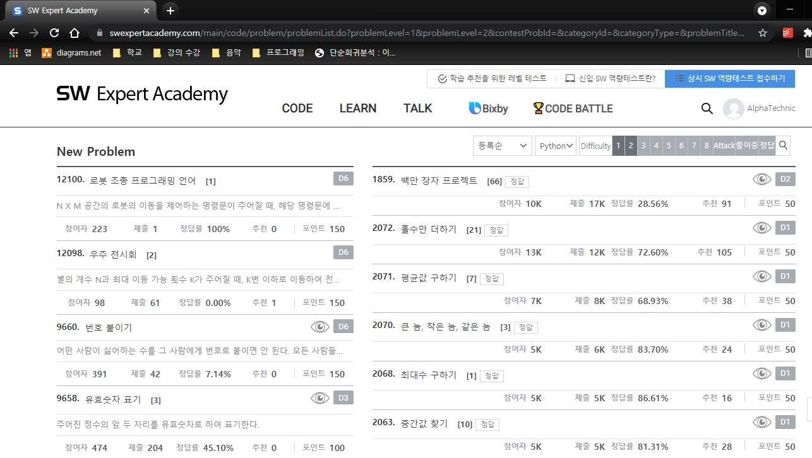
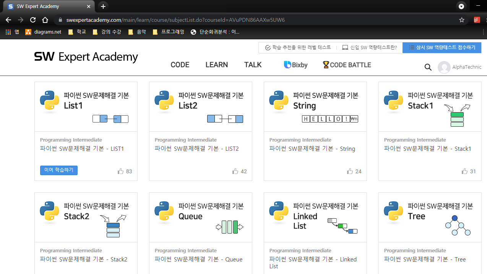

# Learn through SWEA

## Basic problems

- Learn the python language while solving the basic problems of SWEA
- Solve D1(Difficulty1), D2, D3 problems (They are basic problems)

## Intermeidate course

- Learn the basic data structures through SWEA intermediate course.

Link : https://swexpertacademy.com
